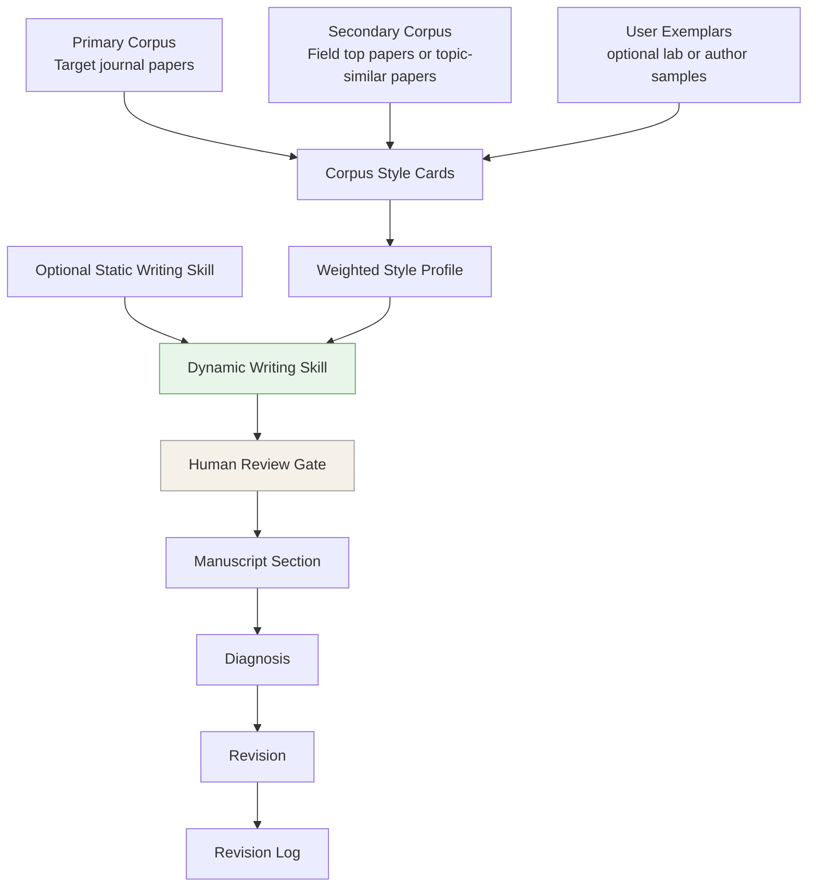

# journal-adapt-writing-skill

> **A dynamic academic writing skill framework. Combine static writing skills with corpus-derived journal and field signals, then revise a manuscript with an auditable temporary skill.**


Most academic writing tools are static: they apply one set of rules to every manuscript. That helps with general style, but it misses the local writing culture of a target journal, a field, or a family of high-quality papers.

**journal-adapt turns static writing rules into a dynamic, corpus-grounded writing skill.** It reads a user-provided reference corpus, extracts structural and rhetorical writing patterns, combines them with an optional base writing skill, and produces a temporary skill for revising one manuscript section by section.

The result is not an auto-writer. It is a reviewable writing workflow: the generated rules are visible, editable, and applied with strict preservation constraints.

---

## What This Project Does



The framework has two layers:

1. **Static base layer** — optional writing skills that provide general rules.
2. **Dynamic adaptation layer** — corpus-derived rules that adapt the base layer to a specific journal, field, topic, and manuscript.

---

## Static Writing Skills Are Optional

You can run journal-adapt with or without a base skill.

| Base input | When to use it |
|------------|----------------|
| Discipline-specific open-source writing skills | You want field-aware defaults, such as economics, ML/NLP, engineering, or management writing norms. |
| Your own writing skill | You already have a lab guide, advisor preference file, previous prompt, or custom `SKILL.md`. |
| General academic writing skills | You want broad constraints such as anti-AI phrasing, citation preservation, equation safety, or concise academic prose. |
| No base skill | You want the dynamic corpus signal to drive the revision on its own. |

When rules conflict, journal-adapt follows the priority system below.

---

## Priority System

| Priority | Source | Rule |
|----------|--------|------|
| P1 | Hard constraints | Preserve facts, citations, equations, notation, numerical results, labels, and author-defined terminology. |
| P2 | Target journal corpus | Follow strong target-journal patterns. |
| P3 | Secondary corpus and exemplars | Use high-quality field patterns or user/lab preferences when target-journal evidence is absent or weak. |
| P4 | Static base skill | Apply discipline or general writing rules when corpus signals do not decide. |
| P5 | Cleanup rules | Remove AI-taste phrases, hollow transitions, generic contributions, and unsupported overclaims. |

P1 always wins. P2 usually beats P3 and P4. Any conflict that changes revision behavior should be recorded in the revision log.

---

## Corpus Design

The reference corpus does not have to be limited to the target journal.

| Corpus role | Recommended size | Required? | Purpose |
|-------------|------------------|-----------|---------|
| Primary corpus: target journal papers | 5-8 papers | Yes | Learns the target journal's local writing conventions. |
| Secondary corpus: field top papers | 2-5 papers | Optional | Adds high-quality field writing patterns when relevant to the manuscript topic or method. |
| User/lab exemplars | 1-3 documents | Optional | Captures local author, advisor, or lab preferences. |

The target journal should usually receive the highest weight. Secondary corpus files and user/lab exemplars are optional; they help when the target journal corpus is small, mixed, or methodologically thin, or when the user wants to preserve a known writing preference.

---

## Quick Start

### 1. Install the skill

For Claude Code:

```bash
mkdir -p ~/.claude/skills/journal-adapt
cp -R skill/* ~/.claude/skills/journal-adapt/
```

For Codex, copy or symlink the `skill/` folder into your Codex skills directory if your local setup supports custom skills. You can also keep the repository open and ask Codex to use `skill/SKILL.md` directly.

More detail: [Installation and PDF Conversion](docs/INSTALLATION.md).

### 2. Prepare inputs

Minimum Markdown workflow, no MinerU required:

```text
my_project/
├── corpus/
│   ├── target_journal_001.md
│   ├── target_journal_002.md
│   └── field_top_paper_001.md
└── manuscript.md
```

PDF workflow:

```text
my_project/
├── corpus_pdfs/
│   ├── paper_001.pdf
│   └── paper_002.pdf
└── manuscript.pdf
```

PDF input requires a PDF-to-Markdown converter. MinerU is supported, but Markdown input is the recommended path if MinerU is hard to install.

### 3. Invoke

```text
/journal-adapt
```

Or ask:

```text
Help me build a dynamic writing skill for my manuscript using these target-journal papers and this base writing skill.
```

The skill will ask for:

1. Target journal or writing destination
2. Primary corpus folder
3. Optional secondary corpus folder
4. Optional user/lab exemplar files
5. Optional base writing skill
6. Manuscript file
7. Sections to revise

---

## Output

Saved next to the manuscript:

```text
[manuscript_name]_revised/
├── dynamic_writing_skill.md
├── style_profile.md
├── abstract_revised.md
├── introduction_revised.md
├── ...
├── [section]_revision_log.md
└── revision_summary.md
```

The revised files are Markdown. Move them into LaTeX, Word, or another writing environment after review.

---

## Example

`examples/jeem/` shows an anonymized MVP run for the Journal of Environmental Economics and Management:

- corpus-role metadata
- conversion gate report
- aggregated style profile
- generated dynamic writing skill
- sanitized section diagnosis, revision sample, and revision log

Raw PDFs, converted full text, and the private manuscript are not included.

---

## Documentation

- [Installation and PDF Conversion](docs/INSTALLATION.md)
- [Static Skill Recommendations](docs/STATIC_SKILL_RECOMMENDATIONS.md)
- [System Architecture](docs/ARCHITECTURE.md)
- [Module Specifications](docs/MODULES.md)
- [Templates](docs/templates/)

---

## Known Limitations

- English-language academic writing only.
- PDF conversion quality depends on the converter. MinerU can fail on some local setups.
- The project extracts writing structure and rhetorical patterns only. It must not quote or paraphrase copyrighted corpus papers.
- The generated dynamic skill needs human review before revision begins.
- The tool does not add facts, citations, results, or claims that are not already in the manuscript.

---

## Contributing

Useful contributions include:

- new static base writing skills for disciplines not covered here
- better installation paths for Claude Code, Codex, and other agent environments
- safer PDF-to-Markdown conversion recipes
- more anonymized example corpora
- improvements to style-card and revision-log templates

One base skill per file is preferred. Keep example corpora free of copyrighted full text and unpublished manuscript details.

---

## License

MIT
