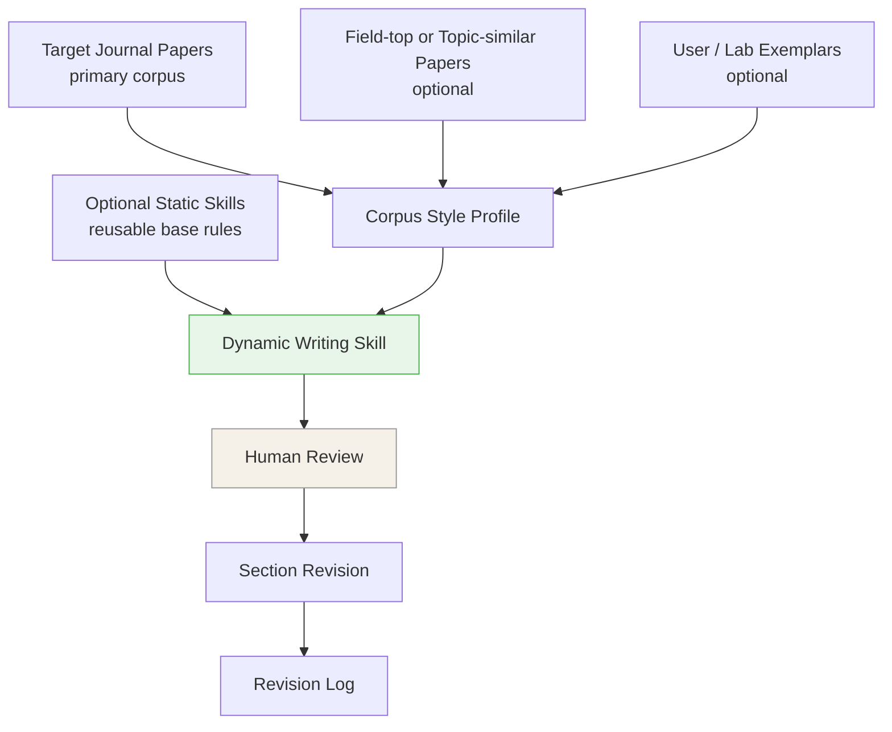

# journal-adapt-docx


## Personal Note

This is my personal copy of [WantongC/journal-adapt-writing-skill](https://github.com/WantongC/journal-adapt-writing-skill).

The original idea and main framework come from that repository. I keep this copy under my own GitHub account only so I can adjust the skill for my own manuscript-writing needs and sync the same version across my devices.

My main personal change is: when a manuscript is a Word/DOCX file with EndNote, Cite While You Write, Word field codes, automatic numbering, cross-references, captions, or a generated bibliography, the skill should not convert the DOCX to Markdown for revision. It should work on a duplicate DOCX in WPS Writer tracked-changes mode, so I can review and accept/reject edits manually.

This repository is not meant to replace the original project or claim credit for it.

---

## What I Use This For

I want one skill that can keep improving with my own needs, especially for medical manuscript writing.

Examples of things I may keep adding later:

- CONSORT / STROBE / PRISMA awareness
- medical journal writing preferences
- EndNote and Cite While You Write safety
- WPS tracked-changes workflow
- my own preferred revision rules

The goal is simple: adjust the skill once, upload it to GitHub, and reuse the same version on different computers.

---

## My Sync Workflow

### 1. Adjust the skill on one computer

When I notice a new need, I can edit this skill once.

For example, if I want it to pay more attention to CONSORT, STROBE, PRISMA, EndNote, or WPS tracked changes, I can ask Codex to update the skill files in this local repository:

```bash
cd /Users/shirc/Documents/投稿/journal-adapt-writing-skill
```

### 2. Upload the updated skill to GitHub

After the skill is changed, commit and push:

```bash
git add .
git commit -m "Update journal-adapt skill"
git push
```

Then the GitHub copy is updated:

```text
https://github.com/NancyShiRC/journal-adapt-docx
```

### 3. Install on another computer for the first time

On a new computer:

```bash
git clone git@github.com:NancyShiRC/journal-adapt-docx.git
mkdir -p ~/.codex/skills/journal-adapt-writing-skill
cp -R journal-adapt-docx/skill/* ~/.codex/skills/journal-adapt-writing-skill/
```

Then restart Codex.

### 4. Update another computer later

If the repository already exists on that computer:

```bash
cd journal-adapt-docx
git pull
cp -R skill/* ~/.codex/skills/journal-adapt-writing-skill/
```

Then restart Codex.

This way, I do not need to teach or modify the skill again on every computer. I only keep GitHub as the shared copy.

---

## Original Skill Summary

### Static + Dynamic



### Optional Static Skills

The static layer is optional. You can choose an existing open-source skill, bring your own, or skip this layer.

| Static option | Field / purpose | Source |
|---------------|-----------------|--------|
| Economics writing | Economics writing and referee-style guidance | [hanlulong/econ-writing-skill](https://github.com/hanlulong/econ-writing-skill) |
| ML / CV / NLP writing | Research paper writing for ML-style papers | [Master-cai/Research-Paper-Writing-Skills](https://github.com/Master-cai/Research-Paper-Writing-Skills) |
| CS / research paper writing | Research paper pipeline for CS systems, networking, and ML-adjacent papers | [SNL-UCSB/paper-writing-skill](https://github.com/SNL-UCSB/paper-writing-skill) |
| Philosophy / interdisciplinary writing | Academic paper planning and composition | [lishix520/academic-paper-skills](https://github.com/lishix520/academic-paper-skills) |
| General AI-writing cleanup | Generic AI-writing cleanup / humanizing constraints | [blader/humanizer](https://github.com/blader/humanizer) |

More details: [Static Skill Recommendations](docs/STATIC_SKILL_RECOMMENDATIONS.md).

You can also use a custom static skill:

| Custom input | Use when |
|--------------|----------|
| Your own `SKILL.md` | You already have reusable agent instructions. |
| Lab/advisor writing guide | Your group has stable style preferences. |
| Journal or field checklist | You want a lightweight rule sheet instead of a full skill. |
| No static skill | You want the dynamic corpus to drive the workflow on its own. |

### Dynamic Corpus

The dynamic corpus is the main feature. It is broader than "papers from the target journal."

| Corpus role | Required? | What it contributes |
|-------------|-----------|---------------------|
| **Primary corpus: target-journal papers** | Yes | The journal's local writing culture: structure, contribution framing, method/result exposition, discussion scope. |
| **Secondary corpus: field-top or topic-similar papers** | Optional | High-quality field writing when the target-journal corpus is small or when the topic needs extra reference points. |
| **User/lab exemplars** | Optional | Author, advisor, or lab preferences that should be preserved when they do not conflict with the target journal. |

The target journal usually has the highest priority. Optional secondary papers and user/lab exemplars enrich the dynamic skill, but they do not override reviewed target-journal patterns unless the user explicitly chooses that behavior.

### Priority System

| Priority | Source | Rule |
|----------|--------|------|
| P1 | Hard constraints | Preserve facts, citations, equations, notation, numerical results, labels, and author-defined terminology. |
| P2 | Target journal corpus | Follow reviewed target-journal patterns. |
| P3 | Secondary corpus and exemplars | Use high-quality field patterns or user/lab preferences when target-journal evidence is absent or weak. |
| P4 | Static base skill | Apply discipline or general writing rules when corpus signals do not decide. |
| P5 | Cleanup rules | Remove AI-taste phrases, hollow transitions, generic contributions, and unsupported overclaims. |

P1 always wins. P2 usually beats P3 and P4. Any conflict that changes revision behavior should be recorded in the revision log.

---

### Corpus Preparation

Recommended starting point:

| Corpus role | Recommended size |
|-------------|------------------|
| Primary corpus: target-journal papers | 5-8 papers |
| Secondary corpus: field-top or topic-similar papers | 2-5 papers |
| User/lab exemplars | 1-3 documents |

All corpus files should be fully readable Markdown/text before Phase 1. If a PDF conversion is incomplete, retry conversion, use another converter, provide clean Markdown/text, or replace the paper.

---

## Quick Start

### 1. Install the skill

For Claude Code:

```bash
mkdir -p ~/.claude/skills/journal-adapt
cp -R skill/* ~/.claude/skills/journal-adapt/
```

For Codex, copy or symlink the `skill/` folder into your Codex skills directory if your local setup supports custom skills. You can also keep the repository open and ask Codex to use `skill/SKILL.md` directly.

Local Codex example:

```bash
mkdir -p ~/.codex/skills/journal-adapt-writing-skill
cp -R skill/* ~/.codex/skills/journal-adapt-writing-skill/
```

More detail: [Installation and PDF Conversion](docs/INSTALLATION.md).

### 2. Prepare inputs

Minimum Markdown workflow, no MinerU required:

```text
my_project/
├── corpus/
│   ├── target_journal_001.md
│   ├── target_journal_002.md
│   └── field_top_paper_001.md
└── manuscript.md
```

PDF workflow:

```text
my_project/
├── corpus_pdfs/
│   ├── paper_001.pdf
│   └── paper_002.pdf
└── manuscript.pdf
```

PDF input requires a PDF-to-Markdown converter. MinerU is supported, but Markdown input is the recommended path if MinerU is hard to install.

Word manuscript workflow for EndNote/CWYW safety:

```text
my_project/
├── corpus/
│   ├── target_journal_001.md
│   └── target_journal_002.md
└── manuscript_with_endnote_fields.docx
```

For Word manuscripts, the skill should create a duplicate named like `manuscript_with_endnote_fields_journal_adapt_tracked.docx`, enable WPS Writer tracked changes, and revise the duplicate in place. The original DOCX should remain untouched.

### 3. Invoke

```text
/journal-adapt
```

Or ask:

```text
Help me build a dynamic writing skill for my manuscript using these target-journal papers and this base writing skill.
```

The skill will ask for:

1. Target journal or writing destination
2. Primary corpus folder
3. Optional secondary corpus folder
4. Optional user/lab exemplar files
5. Optional base writing skill
6. Manuscript file
7. Sections to revise

---

## Output

For Markdown/text/LaTeX manuscripts, outputs are saved next to the manuscript:

```text
[manuscript_name]_revised/
├── dynamic_writing_skill.md
├── style_profile.md
├── abstract_revised.md
├── introduction_revised.md
├── ...
├── [section]_revision_log.md
└── revision_summary.md
```

For Word manuscripts that contain EndNote/CWYW fields or Word automation, the tracked-change DOCX copy is the main deliverable:

```text
[manuscript_name]_journal_adapt_tracked.docx
```

The original DOCX is not modified. Review the duplicate in WPS/Word and manually accept or reject tracked changes.

---

## Example

`examples/jeem/` shows an anonymized MVP run for the Journal of Environmental Economics and Management:

- corpus-role metadata
- conversion gate report
- aggregated style profile
- generated dynamic writing skill
- sanitized section diagnosis, revision sample, and revision log

Raw PDFs, converted full text, and the private manuscript are not included.

---

## Documentation

- [Installation and PDF Conversion](docs/INSTALLATION.md)
- [Static Skill Recommendations](docs/STATIC_SKILL_RECOMMENDATIONS.md)
- [System Architecture](docs/ARCHITECTURE.md)
- [Module Specifications](docs/MODULES.md)
- [Templates](docs/templates/)

---

## Known Limitations

- English-language academic writing only.
- PDF conversion quality depends on the converter. MinerU can fail on some local setups.
- DOCX manuscripts with EndNote/CWYW or Word fields should be revised through WPS/Word tracked changes on a duplicate, not through DOCX-to-Markdown conversion.
- The project extracts writing structure and rhetorical patterns only. It must not quote or paraphrase copyrighted corpus papers.
- The generated dynamic skill needs human review before revision begins.
- The tool does not add facts, citations, results, or claims that are not already in the manuscript.

---

## Contributing

Useful contributions include:

- new static base writing skills for disciplines not covered here
- better installation paths for Claude Code, Codex, and other agent environments
- safer PDF-to-Markdown conversion recipes
- more anonymized example corpora
- improvements to style-card and revision-log templates

One base skill per file is preferred. Keep example corpora free of copyrighted full text and unpublished manuscript details.

---

## License

MIT
