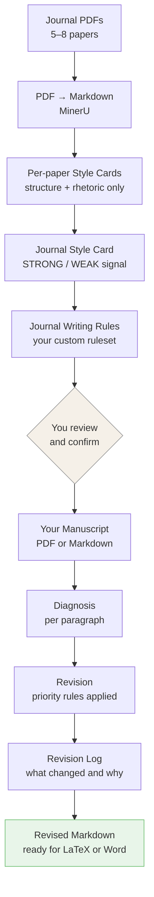

# journal-adapt

> **Learn any journal's writing conventions from its published papers. Revise your manuscript to match — section by section.**


You know what your paper says. Getting it past reviewers at a specific journal is where it stalls.

Every journal has unwritten rules — how introductions are framed, how contributions are stated, how deep the policy discussion should go. Most writing skills give you general rules. But general rules don't know that *IJPE* prefers embedded prose over numbered lists, or that *Management Science* opens with a puzzle not a literature gap.

**journal-adapt learns those rules from the journal itself.** It reads published papers from your target journal, extracts their writing conventions, and generates a custom revision ruleset. Then it uses that ruleset to revise your manuscript — section by section, paragraph by paragraph.

Same pipeline. Any journal.

---

## How it works



**Phase 1** (runs once per journal): learns writing conventions from corpus → generates ruleset.  
**Phase 2** (runs per manuscript): applies ruleset → revises and logs every change.

You approve the ruleset before Phase 2 begins. Nothing is fully automated.

---

## Why not a static writing skill?

| | Static skill | journal-adapt |
|--|-------------|--------------|
| Rules source | Fixed, general | Extracted from your target journal |
| Journal coverage | One size fits all | Per-journal, grounded in evidence |
| Update path | Manual rewrite | Re-run Phase 1 with new papers |
| Discipline | Fixed | Pluggable base rules per field |

Static skills (like econ-write, paper-writing-skill) are excellent general tools. journal-adapt is a different layer on top — it adds journal-specific signal that no static skill can provide.

---

## Priority system

Every revision follows a strict hierarchy:

| Priority | What | Rule |
|----------|------|------|
| P1 | Hard preserve | Equations, citation keys, variable names, numerical results — never touched |
| P2 | Journal style | STRONG-signal patterns from your corpus (≥3 papers agree) |
| P3 | Discipline base rules | General writing norms for your field |
| P4 | Always remove | AI-taste phrases, hollow transitions, generic contribution statements |

P2 beats P3. All conflicts logged in the Revision Log.

---

## Prerequisites

**MinerU** — PDF-to-Markdown conversion.

```bash
pip install mineru
mineru --version
```

→ [MinerU install guide](https://github.com/opendatalab/MinerU)

**Claude Code or Codex** with Bash and file tool access.

---

## Installation

```bash
cp -r skill/ ~/.claude/skills/journal-adapt/
```

Verify:

```
~/.claude/skills/journal-adapt/
├── SKILL.md
└── base_rules/
    ├── economics.md
    ├── ml_cv_nlp.md
    ├── cs_engineering.md
    └── general_academic.md
```

---

## Usage

```
/journal-adapt
```

Or say: *"Help me revise my paper for [journal name]."*

The skill asks for:
1. Target journal name
2. Folder of journal PDFs (5–8 papers recommended)
3. Your discipline
4. Your manuscript file (PDF or Markdown)
5. Which sections to revise — or "full paper"

---

## Built-in discipline rules (P3)

| Discipline | Conventions |
|------------|------------|
| Economics | Cochrane, McCloskey, Shapiro |
| ML / CV / NLP | NeurIPS, ICML, ACL |
| CS / Engineering | IEEE, ACM |
| Other | Bring your own file, or skip |

For unlisted fields: provide any writing guide as a plain text or Markdown file, or skip P3 entirely and rely on journal-specific patterns alone.

---

## Output

Saved to `[manuscript_name]_revised/` next to your manuscript file:

```
[manuscript_name]_revised/
├── abstract_revised.md
├── introduction_revised.md
├── ...
├── [section]_revision_log.md    ← per section: what changed and why
└── revision_summary.md          ← reusable rule candidates across all sections
```

Markdown output. Transfer to LaTeX or Word yourself, or pipe to another agent.

---

## Example

`examples/ijpe/` shows a complete Phase 1 run for the *International Journal of Production Economics* (8 papers):
- 8 Paper Style Cards
- Journal Style Card with STRONG / WEAK signal labels
- Generated writing rules

Use it to understand what Phase 1 produces before running it on your own journal.

---

## Known limitations

- MinerU required for PDF input. Markdown manuscripts work without it.
- Table corruption: MinerU sometimes garbles complex tables. Reconstruct from your source before submission.
- No automatic caching: Phase 1 re-runs each session. To skip it, point to an existing `journal_writing_rules.md` directly.
- English manuscripts only.
- No built-in rules for medicine, law, social sciences, or biology. Bring your own file or skip.

---

## Contributing

Pull requests welcome. Most useful: new `base_rules/` files for uncovered disciplines. One file per discipline. Follow the structure of any existing file under `skill/base_rules/`.

---

## License

MIT

